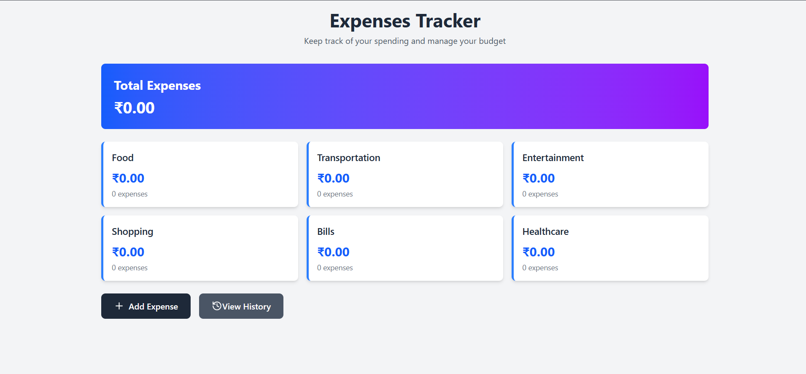
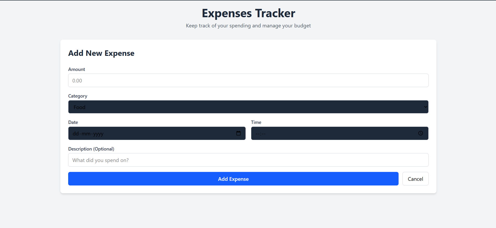
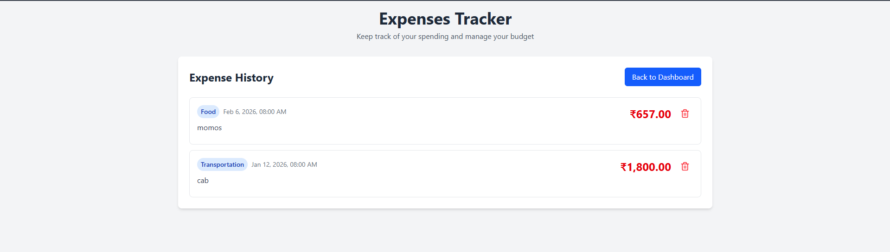

# 💸 Expenses Tracker

A modern and user-friendly **Expense Tracking Web Application** built with React that helps users record, organize, and analyze their spending efficiently.

The application allows users to add expenses, categorize spending, and review expense history through a clean dashboard interface.


---

## 🚀 Features

- Add new expenses with:
  - Amount
  - Category
  - Date & time
  - Optional description

- Dashboard overview showing:
  - Total expenses
  - Category-wise spending summary
  - Number of expenses per category

- Expense history view:
  - Chronologically sorted expense list
  - Expense details display
  - One-click expense deletion

- Responsive and modern UI
- Currency formatted for INR locale

---

## 🛠 Tech Stack

- React.js
- JavaScript (ES6+)
- Tailwind CSS
- Lucide Icons
- React Hooks (`useState`, `useCallback`)

---

## 📂 Project Structure

```text
src/
│
|
├── ExpensesTracker.jsx
└── AddExpenseForm.jsx
│
├── App.jsx
└── main.jsx
```





## ⚙️ Installation & Setup

## Clone the repository:

git clone https://github.com/your-username/expenses-tracker.git


## Move into the project folder:

cd expenses-tracker


## Install dependencies:

npm install


### Run development server:

npm run dev

### 📈 How It Works

1. User adds an expense through the form.
2. Expense data is stored in application state.
3. Dashboard calculates:
   -- Total spending
   -- Category totals.
4. History view sorts expenses by timestamp.
5. Expenses can be removed anytime.


## 🤝 Contribution

Contributions and suggestions are welcome. Fork the repository and submit a pull request.

## 📄 License

This project is open-source and available under the MIT License.

## 👨‍💻 Author

Developed by Sparsh

## ⭐ If you found this project useful, consider giving it a star.
